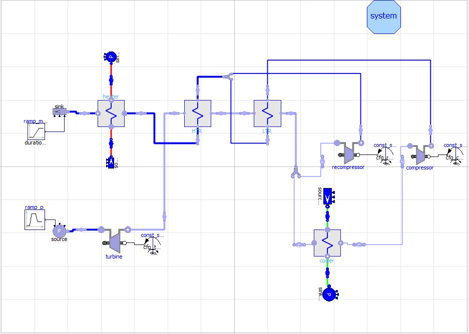
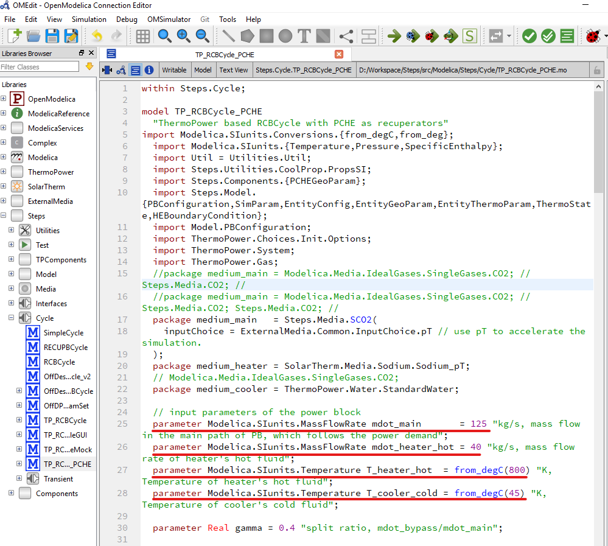
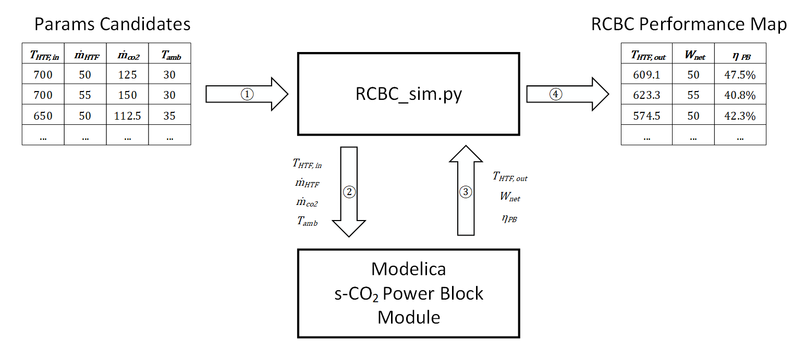
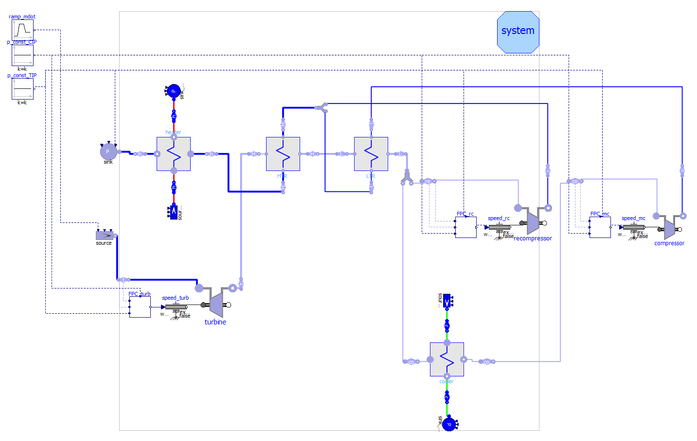

# Supercritical CO2 Power block Emulator

## 1. Introduction

Supercritical CO2 power block emulator (SCOPE) library is an open-source Modelica library designed for supercritical CO2 power block simulation. SCOPE is a proper simulation tool to numerically investigate the off-design and transient performance of s-CO2 RCBC in different application scenarios, such as concentrated solar power (CSP) generation, nuclear power generation, waste heat recovery power generation, etc. The layout of a sCO2 Recompression Brayton Cycle developed by SCOPE is illustrated in Figure 1,


*Figure 1. Re-compression Brayton Cycle Layout in Modelica*

For off-design simulation, SCOPE is able to invest the off-design and part-load RCBC performance and also to generate a performance map over a range of heat transfer fluid (HTF) inlet temperatures, turbine inlet mass flow rates, ambient temperatures and split ratios. By utilizing the generated performance map, it is feasible to quickly predict the annual performance of a s-CO2 power generation system efficiently and accurately with different configurations. 

For transient simulation, SCOPE can predict the uncontrolled dynamic response to a list of external events including step or ramp changes in turbine inlet mass flow rate and pressure, step or ramp changes in the power demand, and step or ramp changes in the HTF inlet temperature or ambient temperature. 

To achieve above objectives, several open-source Modelica libraries or part of their codes are utilized and updated, such as,

- The open-source Modelica library ‘ThermoPower’ is selected to provide the key components such as turbine, compressor and heat exchanger for further modification and assembly to form the 10 MWe s-CO2 RCBC simulation program. 
- The open-source Modelica library ‘ExternalMedia’ is adopted to provide thermodynamic properties of working fluid such s-CO2 and water through querying CoolProp [1] the library. 
- The liquid sodium (Na) model and molten salt model in ‘SolarTherm’ are modified to work with components from ‘ThermoPower’ and to provide thermodynamic properties of the HTF in the primary heat exchanger. 

## 2. 10 MWe sCO2 RCBC off-design simulation using Modelica

In SCOPE, the Modelica code for a 10 WMe s-CO2 RCBC off-design simulation is saved in file ‘{SCOPE_ROOT}\src\Modelica\Steps\Cycle\TP_RCBC_PCHE.mo’, where ‘{SCOPE_ROOT}’ denotes the root directory of project SCOPE. A snapshot of the Modelica code is shown in Figure 2,



*Figure 2. Snapshot of TP_RCBC_PCHE.mo*

As is shown in Figure 2, the simulation code is configured with fixed pre-defined design point values  $T_{HTF,in}=800°C,T_{amb}=45°C, \dot{m}_{co2}=125 kg/s, \dot{m}_{HTF,in}=40 kg/s$  (marked with red under line). Other parameter values can be assigned by modifying these parameters.

To run the simulation, click the simulation button in the toolbar menu to start the simulation and see result. More instruction about how to run a Modelica simulation can be found in [OpenModelica User’s Guide](https://www.openmodelica.org/doc/OpenModelicaUsersGuide/latest/)
### 2.1 Consideration in parameter modification

For a given power block, the off-design simulation is only feasible with valid system parameters. The value of the input parameters can not be set arbitrarily since invalid parameters will cause initial errors or runtime errors and halt the simulation abnormally. For example, the geometry parameter for heater, low temperature recuperator (LTR) and high temperature recuperator (HTR) are selected with careful computation. For turbomachines, the performance maps are also valid within certain range and validity issue should be considered as well. 

It is a complicated task to find the proper parameter values and boundary conditions for given power block. Therefore, on-design simulation involving the design process is required before fulfilling the off-design simulation, through which the system parameters can be figured out. If the design point altered, the configuration of parameters such as geometry (TIM, TIP, channel numbers of LTR, HTR, etc.) should be updated as well to enable the off-design simulation. 

For current configuration (10 WMe sCO2 RCBC), variations ranging in $\pm 15 \%$ of the design point are valid. The feasibility for bigger variations can not be guaranteed.  

## 2. Performance map generation using Python

To fulfill the off-design or part-load performance map generation, a Python script ‘rcbc_sim.py’ is developed to call the Modelica simulation code through external function calling, which is shown in Figure 3,


*Figure 3. Python caller script and Modelica RCBC off-design module*

As is shown in Figure 9, the Python script ‘RCBC_sim.py’ will: 

1)	Import a combination of input parameters, i.e. THTF, in, ṁHTF, ṁCO2, Tamb; 
2)	Send the imported combination to the Modelica s-CO2 RCBC module and run the simulation; 
3)	Retrieve the Modelica simulation result and save it as an item of performance map; 
4)	Iterate every parameter combination and collect all the simulation results to generate the 10 WMe s-CO2 RCBC off-design performance map. 

The Python script 'rcbc_sim.py' is located at ‘{SCOPE_ROOT}/src/python/rcbc_sim.py’, where ‘SCOPE_ROOT’ denotes the root directory of project SCOPE. The Python script sweeps all possible input parameter combination to obtain power block performance under varied off-design configurations. The simulation results including net power output, power block efficiency and HTF outlet temperature will be collected to generate the RCBC performance map, which can be used to determine the power block performance quickly and accurately by querying these pre-calculated data. 

The performance map generation process has been coded in function ‘gen_performance_map’ in the Python script ‘rcbc_sim.py’. This function executes all the required operations such as parameters transmission, results collection, performance data management, map storage and error handling to generate the performance map.  A code snippet is shown below about how to call the function,

``` Python

if __name__ == "__main__":

    mdot_main_des = 125 # Working fluid mass flow rate design point. 

    # call the parameter sweep function to generate performance map
    gen_performance_map(
        mdot_heat = [30, 35, 40, 45],
        mdot_main = list(map(lambda x: x * mdot_main_des/100, [75, 90, 100, 120])),
        T_HTF_in  = list(map(lambda x: from_degC(x), [550, 600, 650, 700])),
        T_amb     = list(map(lambda x: from_degC(x), [30, 35, 40, 45]))
    )

```

## 3. 10 MWe sCO2 RCBC Transient Simulation in Modelica

In SCOPE, the logic and configuration of a 10 WMe sCO2 RCBC transient simulation is saved in file '{SCOPE_ROOT}/src/Modelica/Steps/Cycle/Transient/TPDyn_RCBCylce.mo'. The graphical user interface (GUI) of the simulation code is shown in Figure 4,


*Figure 4. GUI of 10 MWe sCO2 RCBC Transient Simulation*

In Figure 4, constant value, step change or ramp change in the turbine inlet mass flow rate (TIM) or turbine inlet pressure (TIP) can be applied to change the boundary conditions dynamically for the RCBC transient simulation. Furthermore, when TIP or TIM changes during the transient simulation, the turbine or compressor’s shaft speed should be adjusted accordingly. Otherwise, significant discrepancies in mass flow rate or pressure will be witnessed on the opposite side of the virtual break, i.e. at the source and the sink of the power block. Actually, the thermodynamic states and hydraulic properties should be identical at source and sink component since they physically stand for same location in the loop. Therefore, three speed controllers are developed in SCOPE to adjust turbomachines’ shaft speed and to achieve the equilibrium states between source and sink. More effects of the speed controllers will be presented in the result presentation. 

To run the transient simulation, please follow similar procedure as in Section 1 about how to start the off-design simulation. Also, the validity issue of system parameters should also be paid attention to. 
 
## 4. Prerequisites

To run SCOPE, several open-source libraries are required, 

- ExternalMedia and CoolProp. These two libraries are required to provide the thermo-physical properties of the super critical $\text{CO}_2$. Two windows-based platform dynamic link libraries (DLLs) are included in '{SCOPE_ROOT}/lib'. 
- ThermoPower. ThermoPower is a Modelica open-source library which is distributed with OpenModelica. 
- SolarTherm. [SolarTherm](https://github.com/SolarTherm/SolarTherm ) is an open source Modelica project developed by ANU team for Solar thermal power station performance simulation and optimisation. It is required to provide the properties of the HTF such as liquid sodium and molten salt. 

## Reference 

1. Bell, I.H., et al., Pure and Pseudo-pure Fluid Thermophysical Property Evaluation and the Open-Source Thermophysical Property Library CoolProp. Industrial & Engineering Chemistry Research, 2014. 53(6): p. 2498--2508.

